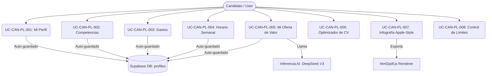

# Documentación de Gobierno y Casos de Uso — Proyecto Laboral & Autoconocimiento

Este documento detalla la gobernanza técnica, funcional, arquitectónica y de seguridad del **Módulo de Proyecto Laboral & Autoconocimiento (ReporteLaboral, ProyectoLaboral & Infografias)** de la plataforma ELVIA. Está diseñado con el nivel de detalle necesario para ser utilizado como especificación de referencia para un desarrollo desde cero.

---

## 🧩 Formato B: Ficha de Módulo — Proyecto Laboral & Autoconocimiento

| Campo | Respuesta |
| :--- | :--- |
| **Módulo** | Proyecto Laboral & Infografía de Autoconocimiento (Atlas Ejecutivo). |
| **Responsabilidad** | **Qué resuelve**: Provee un centro de control interactivo estructurado en 6 pilares estratégicos para guiar al candidato en su transición laboral. Recopila información de perfil, competencias, gastos, disponibilidad, e Ikigai, y los consolida en una infografía interactiva premium descargable en formato PDF (Atlas Ejecutivo) de alta fidelidad estética.<br>**Qué NO resuelve**: No realiza la postulación directa automática a vacantes externas (se limita al análisis y la preparación estratégica). |
| **Usuarios** | Roles del sistema: `user` (Candidatos / Colaboradores B2C y B2B) y `Superadmin` (Auditoría / Soporte). |
| **Casos de uso incluidos** | `UC-CAN-PL-001`, `UC-CAN-PL-002`, `UC-CAN-PL-003`, `UC-CAN-PL-004`, `UC-CAN-PL-005`, `UC-CAN-PL-006`, `UC-CAN-PL-007`, `UC-CAN-PL-008`. |
| **Tablas / Colecciones** | `profiles.job_search_profile` (almacenamiento de los 6 pilares en JSONB), `profiles` (datos personales fijos), `cv_results` (registro de la infografía generada en formato JSON/HTML y PDF path). |
| **Endpoints y APIs** | • `GET /api/cv/proyecto-laboral` (Cargar perfilador)<br>• `POST /api/cv/proyecto-laboral/save` (Guardado manual/auto-save)<br>• `POST /api/cv/oferta-valor-ia` (Inferencia LLM de Elevator Pitch)<br>• `GET /api/company/infografias/:id` (Renderizador de reporte)<br>• `POST /api/company/infografias/generate` (Límite y registro en `cv_results`). |
| **Reglas de negocio** | **1. Progreso Ponderado**: La barra de progreso de autoconocimiento se calcula de forma incremental según el peso específico de cada pilar:<br>&nbsp;&nbsp;&nbsp;&nbsp;- Mi Perfil: 20%<br>&nbsp;&nbsp;&nbsp;&nbsp;- Competencias: 20%<br>&nbsp;&nbsp;&nbsp;&nbsp;- Gastos: 10%<br>&nbsp;&nbsp;&nbsp;&nbsp;- Horario Semanal: 10%<br>&nbsp;&nbsp;&nbsp;&nbsp;- Mi Oferta de Valor: 30%<br>&nbsp;&nbsp;&nbsp;&nbsp;- Optimizador de CV: 10%<br>**2. Desbloqueo de Premios**: El Atlas Ejecutivo de Autoconocimiento se desbloquea al superar el **70% de progreso**. La suite premium de Auditoría de LinkedIn Pro se desbloquea estrictamente al alcanzar el **100% de progreso**.<br>**3. Aislamiento de Pestaña**: La infografía interactiva debe abrirse obligatoriamente en una pestaña nueva (`_blank`) para evitar la pérdida de sesión o el desmontaje del estado de la página principal.<br>**4. Control de Cuota**: Se restringe a un límite estricto de 10 generaciones de infografías por demo para evitar abusos de consumo LLM.<br>**5. Resiliencia de Guardado**: Guardado automático en caché client-side (`sessionStorage`) al cambiar de pestaña en menos de 1ms, con sincronización por debounce de 1.5s hacia Supabase DB. |
| **Dependencias** | • `html2pdf.js` (Versión 0.10.1, con empaquetador `html2canvas` y `jspdf` para exportación local en Letter 8.5" x 11" a 300dpi sin desbordamientos de página).<br>• Google Fonts (*Plus Jakarta Sans*, *Bricolage Grotesque* e *Inter Tight*).<br>• Lucide Icons / Phosphor Icons (Representación de estatus). |
| **Riesgos Técnicos** | Latencia en generación de PDF local en navegadores móviles debido a la carga gráfica del SVG interactivo del cuadrante Ikigai. |
| **Definition of Done (DoD)**| - Cada pilar alcanza el 100% de su completado bajo reglas estrictas de validación de campos.<br>- El archivo PDF resultante se descarga limpio en una única página carta y sin cortes de texto.<br>- El mapa de calor semanal se dibuja de forma responsiva en móvil y escritorio. |

---

## 📄 Formato A: Casos de Uso de Proyecto Laboral & Autoconocimiento



---

### 1. UC-CAN-PL-001: Registrar y Perfilar Metas Laborales (Mi Perfil)
*   **ID**: `UC-CAN-PL-001`
*   **Nombre**: Completar y guardar "Mi Perfil" estratégico.
*   **Actor principal**: `user` (Candidato).
*   **Actores secundarios**: Supabase DB (Persistencia), `sessionStorage` (Caché local).
*   **Objetivo**: Permitir al candidato estructurar su información personal básica, expectativas salariales por país e identificar las 5 empresas de ensueño para dirigir su búsqueda.
*   **Precondiciones**: Sesión activa de usuario autenticado en la plataforma.
*   **Flujo principal**:
    1.  El Candidato ingresa a la sección de `/proyecto-laboral` y selecciona el pilar **Mi Perfil**.
    2.  El sistema despliega un panel interactivo subdividido internamente en tres pestañas:
        *   **Datos Personales**: Nombre1, Nombre2, Apellido1, Apellido2 (Campos de solo lectura nombre1/apellido1 para mantener integridad de registro), País (Selector de países LATAM), Ciudad actual, Edad, e Indicativo telefónico + Teléfono principal.
        *   **Compensación**: País para prestaciones (el cual gatilla los campos de prestaciones de ley sugeridos para ese país, ej. IMSS/AFORE en México o EPS/Cesantías en Colombia), Moneda y Expectativa de Salario Bruto Mensual (con formateador numérico en tiempo real, ej. `50,000` o `50.000` según moneda), y prestaciones extra.
        *   **Perfilador (Aspiraciones)**: Áreas de especialización deseadas, niveles de cargo objetivo (desde Analista a C-Level), idiomas dominados y su nivel CEFR (ej: C1, B2).
    3.  Al final de la pestaña **Perfilador**, el sistema despliega el bloque **Top 5 Compañías Objetivo**:
        *   Cinco campos secuenciales de entrada de texto.
        *   El candidato escribe al menos 1 empresa deseada (ej. *Google*, *MercadoLibre*).
    4.  El Candidato presiona el botón **Guardar y continuar** (o se dispara el guardado automático debounced tras 1.5 segundos de inactividad de tipeo).
    5.  El sistema valida los campos obligatorios.
    6.  El sistema persiste los datos en `profiles.job_search_profile` y actualiza instantáneamente en caché `sessionStorage.setItem('perfil_lp_' + userId, ...)` para carga instantánea de pestaña en menos de 1ms.
    7.  La barra de progreso del pilar "Mi Perfil" se actualiza al **100%** sumando **20%** al progreso global del Proyecto Laboral.
*   **Flujos alternos y de excepción**:
    *   *Flujo Alterno - Selección de País Diferente*: Si el usuario cambia el selector de País a uno con patrón monetario distinto (ej. cambiar de Colombia a México), el sistema reformatea el símbolo (`$` a `MXN`/`COP`) y vacía los campos de prestaciones previas para forzar la selección de la ley correspondiente.
    *   *Flujo de Excepción - Validación de Campos Obligatorios*: Si el usuario intenta guardar manualmente el pilar y no ha seleccionado el **País** o el **Cargo deseado**, el sistema despliega un modal con la lista de campos faltantes e impide subir los datos a Supabase, manteniendo el estado local intacto.
*   **Datos usados**: `profiles.nombre1`, `profiles.apellido1`, `profiles.job_search_profile.perfil` (campos: `nombre_cargo`, `salario_monto`, `moneda`, `ciudad`, `pais`, `top5empresas`, `idiomas`).
*   **Pruebas mínimas de aceptación (QA)**:
    1.  Rellenar el formulario con País "México", Salario "80,000", Idioma "Inglés C1" y Empresa objetivo "Google".
    2.  Presionar Guardar, verificar el guardado en consola de red (`POST /api/cv/proyecto-laboral/save` con estado HTTP 200).
    3.  Navegar a otra ruta del sistema, presionar F5, regresar a `/proyecto-laboral` y verificar la carga instantánea sin spinners en < 1ms utilizando la caché local de sesión.

---

### 2. UC-CAN-PL-002: Clasificación y Mapeo de Competencias (Competencias)
*   **ID**: `UC-CAN-PL-002`
*   **Nombre**: Definir y categorizar Competencias Profesionales.
*   **Actor principal**: `user` (Candidato).
*   **Actores secundarios**: Supabase DB.
*   **Objetivo**: Permitir al candidato auto-evaluarse seleccionando de forma estructurada sus competencias técnicas y humanas de un catálogo predefinido y estandarizado.
*   **Precondiciones**: Acceso activo al módulo `/proyecto-laboral`.
*   **Flujo principal**:
    1.  El Candidato hace clic en el pilar **Competencias** (renderizado con color Violeta y el icono `Brain`).
    2.  El sistema muestra un mensaje de recomendación de mentoría: *"Lo ideal es seleccionar un máximo de 6 Hard Skills y 6 Power Skills. Menos es más"*.
    3.  El sistema despliega dos selectores de acordeón interactivos con barra de búsqueda rápida integrada:
        *   **Hard Skills Picker**: Categorías colapsables (IA y Tecnología, Datos y Operaciones, Gestión y Finanzas, Ventas y Marketing, Industrias).
        *   **Power Skills Picker**: Categorías colapsables (Carácter y Mentalidad, Pensamiento estratégico, Comunicación e Interacción, Liderazgo de equipos, Productividad).
    4.  El Candidato selecciona las tags haciendo clic en ellas. Las seleccionadas cambian visualmente de estilo (`bg-violet-600 text-white` para Hard y `bg-emerald-600 text-white` para Power).
    5.  El Candidato presiona **Guardar**.
    6.  El sistema ejecuta la validación: comprueba que existan **al menos 2 Hard Skills** y **al menos 2 Power Skills** seleccionadas.
    7.  Los datos se guardan en el objeto `profiles.job_search_profile.autoconocimiento` en la base de datos (Nota técnica: el campo histórico de la base de datos es `soft_skills` para almacenar las Power Skills).
    8.  El progreso del pilar "Competencias" alcanza el **100%** sumando **20%** al progreso global del Proyecto Laboral.
*   **Flujos alternos y de excepción**:
    *   *Flujo de Excepción - Selección Insuficiente*: Si el Candidato selecciona menos de 2 habilidades en cualquiera de las dimensiones y presiona "Guardar":
        1. El sistema despliega un modal elegante de bloqueo titulado *"Sección incompleta"*, listando específicamente cuál dimensión está incompleta (ej. *"Power Skills — selecciona al menos 2"*).
        2. El modal provee dos botones: **Volver a completar** (cierra el modal enfocando la sección errónea) o **Guardar así** (permite forzar el guardado en base de datos pero no otorga el 100% de completado a la sección en la barra de progreso general).
*   **Datos usados**: `job_search_profile.autoconocimiento.hard_skills` (Array de strings), `job_search_profile.autoconocimiento.soft_skills` (Array de strings).
*   **Pruebas mínimas de aceptación (QA)**:
    1.  Ingresar a Competencias, seleccionar únicamente 1 Hard Skill e intentar guardar. Verificar la aparición del modal de alerta.
    2.  Hacer clic en "Guardar así" y confirmar que los datos se persisten en Supabase pero el progreso global no sume el 20% completo.
    3.  Agregar 2 Hard Skills y 2 Power Skills adicionales, presionar Guardar y verificar que el pilar figure con estado `100%` completo.

---

### 3. UC-CAN-PL-003: Estimar Presupuesto y Gastos de Búsqueda (Gastos)
*   **ID**: `UC-CAN-PL-003`
*   **Nombre**: Registrar y calcular el Presupuesto Mensual de Búsqueda de Empleo.
*   **Actor principal**: `user` (Candidato).
*   **Actores secundarios**: Supabase DB.
*   **Objetivo**: Permitir al candidato dimensionar económicamente el costo mensual asociado a su periodo de transición laboral y registrar recursos clave activos.
*   **Precondiciones**: Sesión activa de usuario.
*   **Flujo principal**:
    1.  El Candidato selecciona el pilar **Gastos** (renderizado en color azul con icono `Toolbox`).
    2.  El sistema carga de forma reactiva la lista de recursos financieros por defecto (`RECURSOS_DEFAULT`) adaptados a la moneda del candidato detectada en Mi Perfil (ej. USD o MXN). Los recursos incluyen items obligatorios y opcionales:
        *   *Laptop / Computadora*
        *   *Internet de alta velocidad*
        *   *Suscripción a herramientas premium (ELVIA Optima)*
        *   *Transporte para entrevistas*
        *   *Cursos de capacitación*
    3.  Cada recurso se visualiza en un contenedor con un interruptor (Toggle switch) de activación (`tengo: true/false`):
        *   Si el switch está inactivo, el contenedor es blanco y los campos de entrada de `nombre`, `descripcion` y `costo` mensual están completamente deshabilitados.
        *   Si el switch está activo, el contenedor cambia a fondo verde suave (`bg-green-50`) y se habilitan los campos para edición.
    4.  El Candidato puede presionar **+ Agregar recurso** para añadir filas personalizadas de gastos.
    5.  El sistema realiza el cálculo matemático síncrono en tiempo real del costo mensual total (`totalAll = sum(costo)`) y lo renderiza de manera destacada en la parte inferior.
    6.  El Candidato presiona **Guardar**.
    7.  El sistema valida que exista **al menos 1 recurso activo** marcado como `tengo: true`.
    8.  Los datos se persisten en `profiles.job_search_profile.recursos`.
    9.  El progreso del pilar "Gastos" alcanza el **100%** sumando **10%** al progreso global del Proyecto Laboral.
*   **Flujos alternos y de excepción**:
    *   *Recurso Optima Especial*: Si el recurso es la suscripción "ELVIA Optima" y el usuario la marca como activa (`tengo: true`), el sistema calcula dinámicamente y bloquea el costo a `$0` utilizando una tasa de conversión basada en pesos mexicanos (suscripción gratuita para demostración).
    *   *Flujo de Excepción - 0 Recursos Seleccionados*: Si el usuario desmarca todos los switches de gastos e intenta guardar, el sistema despliega el modal *"Sección incompleta"* advirtiendo: *"Marca al menos 1 recurso que ya tienes disponible"*. Ofrece la opción de forzar el guardado básico presionando "Guardar así".
*   **Datos usados**: `job_search_profile.recursos` (Estructura de Array de objetos: `{ id, nombre, descripcion, costo, tengo }`).
*   **Pruebas mínimas de aceptación (QA)**:
    1.  Activar "Internet de alta velocidad", cambiar el costo a `50` y presionar guardar. Verificar que el total se actualice en pantalla y se persista el valor numérico limpio.
    2.  Verificar que el botón de borrar (icono de basurero) esté deshabilitado para recursos obligatorios de catálogo base, pero activo para recursos personalizados recién creados.

---

### 4. UC-CAN-PL-004: Programar Disponibilidad en Mapa de Calor Semanal (Horario Semanal)
*   **ID**: `UC-CAN-PL-004`
*   **Nombre**: Programar Horario Semanal de Disponibilidad de Búsqueda.
*   **Actor principal**: `user` (Candidato).
*   **Actores secundarios**: Supabase DB.
*   **Objetivo**: Planificar de manera organizada el tiempo semanal que el candidato asignará activamente a la búsqueda de empleo, viéndolo como un compromiso serio.
*   **Precondiciones**: Sesión activa de usuario.
*   **Flujo principal**:
    1.  El Candidato selecciona el pilar **Horario semanal** (renderizado en color verde esmeralda con icono `CalendarCheck`).
    2.  El sistema muestra un callout de compromiso: *"Trátalo como un trabajo de medio tiempo. Los candidatos exitosos dedican 15+ horas/semana"*.
    3.  El sistema despliega el selector de **Días activos de búsqueda** (Lunes a Domingo). El candidato hace clic en los días en los que desea trabajar.
    4.  Una vez seleccionado al menos un día, el sistema dibuja dinámicamente una matriz (tabla interactiva) con los días seleccionados como columnas y los **Bloques de 2 horas** como filas (7am-9am hasta 7pm-9pm).
    5.  El Candidato hace clic sobre las celdas de la cuadrícula para activar o desactivar bloques de disponibilidad. Las celdas activas se iluminan de color verde esmeralda con un check.
    6.  El sistema calcula de forma dinámica las horas totales asignadas (`totalH = bloques_activos * 2`) y clasifica el ritmo semanal:
        *   **Zona Verde (Excelente)**: `>= 15 horas/semana`. Mensaje: *"Excelente — en la zona de éxito"*.
        *   **Zona Ámbar (Suficiente)**: `>= 8 horas/semana` y `< 15 horas/semana`. Mensaje: *"Bien, agrega algunos bloques más"*.
        *   **Zona Roja (Insuficiente)**: `< 8 horas/semana`. Mensaje: *"Muy poco — el proceso tomará más tiempo"*.
    7.  El Candidato presiona el botón **Guardar**.
    8.  El sistema valida que exista **al menos 1 bloque de horas** activo en la cuadrícula.
    9.  Los datos se guardan en el objeto `profiles.job_search_profile.semana`.
    10. El progreso del pilar "Horario semanal" alcanza el **100%** sumando **10%** al progreso global del Proyecto Laboral.
*   **Flujos alternos y de excepción**:
    *   *Flujo de Excepción - 0 Bloques Activos*: Si el candidato desmarca todos los bloques en la cuadrícula e intenta presionar guardar, el sistema levanta el modal de error controlado *"Sección incompleta - Agrega al menos 1 bloque de horas en tu horario semanal"*.
*   **Datos usados**: `job_search_profile.semana` (estructura con arrays `dias` y objeto clave-valor `bloques` con la firma `"Dia_Hora": true/false`).
*   **Pruebas mínimas de aceptación (QA)**:
    1.  Hacer clic en "Lun" y "Mar". Activar 4 bloques de 2 horas el lunes y 4 bloques el martes.
    2.  Verificar que el contador inferior marque exactamente `16h` en color verde (Zona Excelente). Guardar y recargar la página. Confirmar que la cuadrícula retenga el estado de los bloques pintados.

---

### 5. UC-CAN-PL-005: Formular Oferta de Valor e Ikigai Estratégico (Mi Oferta de Valor)
*   **ID**: `UC-CAN-PL-005`
*   **Nombre**: Redactar y optimizar la Oferta de Valor y el cuadrante de Ikigai con Asistencia de IA.
*   **Actor principal**: `user` (Candidato).
*   **Actores secundarios**: DeepSeek V3 (Inferencia de IA en backend), Supabase DB.
*   **Objetivo**: Guiar al candidato en la redacción detallada de sus pasiones, habilidades rentables e impacto, y permitirle generar un Elevator Pitch estratégico e impactante optimizado por inteligencia artificial.
*   **Precondiciones**: Sesión iniciada. Se recomienda haber seleccionado previamente sus Hard y Power Skills.
*   **Flujo principal**:
    1.  El Candidato hace clic en el pilar **Mi oferta de valor** (color rosa con icono `Sparkle`).
    2.  El sistema despliega dos secciónes clave:
        *   **Los 4 Pilares de tu Ikigai**: Cuatro cajas de texto ricas dedicadas a:
            1. *¿Qué es lo que AMAS?* (`ikigai_amas`)
            2. *¿Para qué eres BUENO/A?* (`ikigai_bueno`)
            3. *¿Qué NECESITA el mundo de ti?* (`ikigai_necesita`)
            4. *¿Por qué podrían PAGARTE?* (`ikigai_pagar`)
        *   **Tu Oferta de Valor Comercial (Elevator Pitch)**: Caja de texto principal (`oferta_valor`) para el resumen comercial del candidato.
        *   **Cultura corporativa**: Tags de cultura organizacional deseadas (ej. *Ágil*, *Feedback continuo*).
    3.  El Candidato puede rellenar las secciones manualmente o presionar el botón **Generar Oferta de Valor con IA** (disponible únicamente si se ha rellenado al menos parte del Ikigai y se tienen habilidades cargadas en el perfil):
        *   El sistema muestra un estado de carga animado (*"Generando tu Elevator Pitch estratégico..."*).
        *   El backend envía una llamada segura `/api/cv/oferta-valor-ia` consumiendo el modelo DeepSeek V3.
        *   El sistema devuelve una propuesta comercial de alto impacto de una sola página y la inserta automáticamente como un borrador editable en el campo `oferta_valor`.
    4.  El Candidato presiona **Guardar**.
    5.  El sistema ejecuta la validación funcional de longitud:
        *   El campo `oferta_valor` debe poseer **mínimo 20 caracteres**.
        *   Cada uno de los 4 campos del Ikigai debe poseer **mínimo 50 caracteres** de análisis y reflexión profunda.
    6.  Si se cumplen todas las longitudes, los datos se persisten en `profiles.job_search_profile.oferta`.
    7.  El progreso de "Mi Oferta de Valor" alcanza el **100%** sumando **30%** al progreso global del Proyecto Laboral.
*   **Flujos alternos y de excepción**:
    *   *Flujo de Excepción - Reflexión Insuficiente*: Si el Candidato escribe menos de 50 caracteres en algún bloque de Ikigai e intenta presionar "Guardar":
        1. El sistema intercepta el guardado y despliega un modal detallado de advertencia indicando la longitud insuficiente en los bloques específicos.
        2. El usuario puede elegir **Volver a completar** para pulir sus textos o **Guardar así** para guardar su progreso actual, aunque esto no marcará la sección al 100% ni activará los créditos completos del progreso general.
*   **Datos usados**: `job_search_profile.oferta` (campos: `oferta_valor`, `cultura`, `ikigai_amas`, `ikigai_bueno`, `ikigai_necesita`, `ikigai_pagar`).
*   **Pruebas mínimas de aceptación (QA)**:
    1.  Escribir un texto de 10 caracteres en el Elevator Pitch e intentar guardar. Comprobar que el modal de advertencia capture el error.
    2.  Utilizar el generador de IA y comprobar que el Elevator Pitch resultante contenga de forma coherente las hard y power skills seleccionadas en el pilar 2.

---

### 6. UC-CAN-PL-006: Acceder y Ejecutar la Optimización del CV (Optimizador de CV)
*   **ID**: `UC-CAN-PL-006`
*   **Nombre**: Analizar Calidad de Perfil y Acceder a Optimizador de CV Harvard.
*   **Actor principal**: `user` (Candidato).
*   **Actores secundarios**: Frontend Router.
*   **Objetivo**: Proveer al candidato una evaluación visual del grado de completitud de su perfil estratégico para nutrir de forma óptima su currículum, y habilitar los accesos de generación.
*   **Precondiciones**: Sesión activa.
*   **Flujo principal**:
    1.  El Candidato selecciona el pilar **Optimizador de CV** (color ámbar con icono `FileMagnifyingGlass`).
    2.  El sistema calcula en tiempo real el porcentaje consolidado de completitud estratégica (`pct`).
    3.  El sistema renderiza un indicador visual dinámico acorde al porcentaje:
        *   Si el progreso es **menor a 100%**: Muestra una barra de gradiente desde violeta a rosa y un mensaje advirtiendo que para un resultado de CV óptimo se aconseja terminar los pilares previos.
        *   Si el progreso es **100%**: Muestra un banner de éxito verde con un check: *"¡Perfil al 100%! Tu CV tendrá toda la información necesaria para destacar"*.
    4.  El sistema ofrece dos tarjetas interactivas de gran formato (Apple-Style) con transiciones suaves:
        *   **Subir mi CV actual**: Al hacer clic, redirige al usuario a la ruta `/cv-desde-cero` inyectando en el estado del router `{ mode: 'upload' }` para disparar el flujo de extracción por IA.
        *   **Empezar de cero**: Al hacer clic, redirige al usuario a la ruta `/cv-desde-cero` inyectando en el estado del router `{ mode: 'scratch' }` para abrir el asistente paso a paso del estándar Harvard ATS.
    5.  El progreso de este pilar se marca al **100%** de forma automática una vez cargado, sumando **10%** al progreso global del Proyecto Laboral.
*   **Datos usados**: Progreso acumulado obtenido por la función síncrona `calcularProgreso(data, perfil)`.
*   **Pruebas mínimas de aceptación (QA)**:
    1.  Verificar que al hacer clic en "Subir mi CV actual" se navegue de forma limpia a `/cv-desde-cero` y se abra la pantalla de drag-and-drop de archivos PDF/Word.
    2.  Validar que la barra de calidad del perfil refleje exactamente el porcentaje ponderado de los 5 pilares previos.

---

### 7. UC-CAN-PL-007: Visualización y Descarga de Infografía Apple-Style (Atlas Ejecutivo)
*   **ID**: `UC-CAN-PL-007`
*   **Nombre**: Visualización y Descarga de la Infografía de Autoconocimiento.
*   **Actor principal**: `user` (Candidato).
*   **Actores secundarios**: `html2pdf.js` (Biblioteca de renderizado de PDF en cliente).
*   **Objetivo**: Generar un documento PDF de altísima fidelidad estética (una sola página, sin cortes) que resuma de forma ejecutiva el autoconocimiento y plan estratégico de carrera del candidato para impresión o entrega.
*   **Precondiciones**: El candidato debe poseer un porcentaje de progreso general en su Proyecto Laboral de **al menos 70%**.
*   **Flujo principal**:
    1.  Una vez superado el 70% de progreso, el sistema desbloquea y destaca con una animación de brillo el botón **Ver Infografía** en la barra lateral y cabecera del Proyecto Laboral.
    2.  El Candidato hace clic en **Ver Infografía**.
    3.  El sistema abre la ruta `/reporte-laboral/:id` en una **nueva pestaña** (`_blank`) para proteger la sesión del usuario.
    4.  El renderizador carga la plantilla con una estética premium inspirada en Apple: fondo hueso minimalista (`#F5F1E6`), tipografías ejecutivas de Google Fonts (*Bricolage Grotesque*), y dibuja dinámicamente un **Diagrama de Venn de Ikigai interactivo SVG** con colores pastel.
    5.  El Candidato revisa la infografía y presiona el botón flotante **Descargar Infografía**.
    6.  La librería `html2pdf.js` en cliente procesa el contenedor HTML:
        *   Aplica estilos CSS de impresión (`@media print`) que ocultan automáticamente los botones flotantes de navegación, iconos de ayuda y tooltips.
        *   Configura el lienzo estrictamente en formato Carta (Letter: 8.5" x 11") con escala ajustada al 100% de la ventana de visualización.
        *   Genera un blob PDF limpio y lo descarga al disco local del usuario con el nombre `ELVIA_Proyecto_Laboral_[Nombre].pdf`.
*   **Flujos alternos y de excepción**:
    *   *Flujo de Excepción - Progreso Insuficiente*: Si un usuario intenta forzar la navegación directa por URL a `/reporte-laboral/:id` sin tener el 70% de progreso:
        1. El router intercepta la carga y valida el progreso real en Supabase.
        2. Si no cumple, realiza una redirección forzada a `/proyecto-laboral` desplegando un toast de advertencia: *"Completa al menos el 70% de tu Proyecto Laboral para desbloquear tu Atlas Ejecutivo"*.
*   **Datos usados**: Objeto de infografía de la tabla `cv_results`.
*   **Pruebas mínimas de aceptación (QA)**:
    1.  Completar el perfilador hasta el 75%. Hacer clic en "Ver Infografía" y verificar que abra en una nueva pestaña sin spinners de carga lentos.
    2.  Hacer clic en descargar PDF y validar que el archivo resultante no tenga cortes horizontales de página, desbordamiento del diagrama SVG ni visibilidad de los botones de interacción.

---

### 8. UC-CAN-PL-008: Control de Cuota de Inferencia y Generación (Backend Limit)
*   **ID**: `UC-CAN-PL-008`
*   **Nombre**: Limitación de Cuotas de Generación de Reportes para Cuentas Demo.
*   **Actor principal**: Sistema / Backend.
*   **Actores secundarios**: `cvController.js` (Backend Node.js).
*   **Objetivo**: Prevenir abusos de consumo e inferencia de modelos LLM en cuentas demostrativas limitando la creación a 10 infografías por cuenta, permitiendo bypass para usuarios Premium o B2B.
*   **Precondiciones**: Intento de generación de infografía o Elevator Pitch por IA.
*   **Flujo principal**:
    1.  El Candidato hace clic en **Generar Reporte de Autoconocimiento**.
    2.  La solicitud es recibida por el backend en Node.js, el cual realiza una consulta agregada a la tabla `cv_results` contando los registros del usuario con tipo `'infografia'`.
    3.  El backend valida la cuota:
        *   Si el total de reportes previos es **menor a 10**, el backend procesa la solicitud, crea la infografía, realiza el cargo de inferencia y devuelve estado `200 OK`.
        *   Si el total es **mayor o igual a 10**, el backend rechaza la solicitud devolviendo un código `403 Forbidden` con el mensaje JSON: `{ error: 'LIMIT_EXCEEDED', message: 'Has alcanzado el límite máximo de 10 generaciones en tu cuenta demo.' }`.
    4.  El frontend intercepta el error `LIMIT_EXCEEDED` y despliega un modal bloqueador amigable ofreciendo la opción de actualizar a un plan ilimitado o contactar a soporte B2B.
*   **Flujos alternos y de excepción**:
    *   *Bypass Premium B2B*: Si el usuario posee una cuenta corporativa autenticada en `profiles.role` como plan pagado o B2B, el backend omite la regla de límite y procesa infinitas solicitudes con normalidad.
*   **Pruebas mínimas de aceptación (QA)**:
    1.  Simular en base de datos 10 registros en `cv_results` para un usuario demo e intentar generar una nueva infografía. Verificar que se despliegue el modal bloqueador con el mensaje de límite excedido.

---

## 🔒 Formato D: Gobernanza de Seguridad (Proyecto Laboral)

### 1. SEC-PL-001: Aislamiento Multitenant (RLS en Supabase)
*   **Declaración**: Los datos almacenados en `profiles` y los reportes en `cv_results` están protegidos por políticas de seguridad RLS a nivel de base de datos. Ningún usuario puede consultar, modificar o eliminar registros que no le pertenezcan.
*   **Implementación**:
    ```sql
    -- Habilitar RLS en las tablas críticas
    ALTER TABLE profiles ENABLE ROW LEVEL SECURITY;
    ALTER TABLE cv_results ENABLE ROW LEVEL SECURITY;

    -- Política para perfiles de usuario
    CREATE POLICY "Usuarios pueden gestionar su propio perfil" 
      ON profiles FOR ALL 
      USING (auth.uid() = id);

    -- Política para los resultados de CV e Infografías
    CREATE POLICY "Usuarios pueden gestionar sus propios reportes" 
      ON cv_results FOR ALL 
      USING (auth.uid() = user_id);
    ```

### 2. SEC-PL-002: Sanitización de Datos e Inyección de Código (XSS/SQLi)
*   **Declaración**: Dado que el candidato escribe texto libre en secciones como el Ikigai y el Elevator Pitch, es obligatorio sanitizar todas las entradas antes de su persistencia e inferencia LLM para evitar ataques Cross-Site Scripting (XSS) y SQL Injection.
*   **Implementación**:
    *   *Frontend*: Uso de inputs reactivos controlados que escapan caracteres HTML especiales y bloquean la inyección de tags `<script>` o `javascript:`.
    *   *Backend*: Uso de parametrización de consultas a través del SDK de Supabase (PostgREST) y validación de expresiones regulares de caracteres no imprimibles:
        ```javascript
        const sanitizarTexto = (txt) => {
          if (!txt || typeof txt !== 'string') return ''
          return txt.replace(/[\x00-\x08\x0B\x0C\x0E-\x1F\x7F]/g, '').trim()
        }
        ```

### 3. SEC-PL-003: Firma y Aislamiento de Infografías
*   **Declaración**: Las infografías y reportes de autoconocimiento guardados en formato JSON en `cv_results` no deben mezclarse ni contaminar los documentos del currículum Harvard estándar del usuario.
*   **Implementación**: Se aplica un filtro estricto en frontend y backend excluyendo de las consultas de historial de CVs cualquier registro en `cv_results` que posea la propiedad `tipo = 'infografia'` o cuyo contenido de texto inicie con la firma de caracteres JSON `'{'`.

---

## 💾 Formato F: Especificaciones de Base de Datos y Esquemas

### 1. Objeto `profiles.job_search_profile` (Base de Datos)
*   **Propósito**: Objeto JSONB estructurado que almacena el avance, configuración de pilares, presupuesto e Ikigai del candidato en la tabla `profiles`.
*   **Esquema JSON Schema de Validación**:
    ```json
    {
      "$schema": "http://json-schema.org/draft-07/schema#",
      "type": "object",
      "properties": {
        "perfil": {
          "type": "object",
          "properties": {
            "nombre_cargo": { "type": "string", "maxLength": 100 },
            "experiencia_anios": { "type": "number", "minimum": 0, "maximum": 50 },
            "salario_monto": { "type": "number", "minimum": 0 },
            "moneda": { "type": "string", "pattern": "^[A-Z]{3}$" },
            "ciudad": { "type": "string" },
            "pais": { "type": "string" },
            "top5empresas": {
              "type": "array",
              "items": { "type": "string" },
              "maxItems": 5
            },
            "idiomas": {
              "type": "array",
              "items": {
                "type": "object",
                "properties": {
                  "idioma": { "type": "string" },
                  "nivel": { "type": "string", "enum": ["Nativo", "C2", "C1", "B2", "B1", "A2", "A1"] }
                },
                "required": ["idioma", "nivel"]
              }
            }
          },
          "required": ["pais"]
        },
        "autoconocimiento": {
          "type": "object",
          "properties": {
            "hard_skills": { "type": "array", "items": { "type": "string" } },
            "soft_skills": { "type": "array", "items": { "type": "string" } }
          },
          "required": ["hard_skills", "soft_skills"]
        },
        "recursos": {
          "type": "object",
          "properties": {
            "recursos": {
              "type": "array",
              "items": {
                "type": "object",
                "properties": {
                  "id": { "type": "string" },
                  "nombre": { "type": "string", "maxLength": 100 },
                  "descripcion": { "type": "string", "maxLength": 300 },
                  "costo": { "type": "number", "minimum": 0 },
                  "tengo": { "type": "boolean" },
                  "obligatorio": { "type": "boolean" }
                },
                "required": ["id", "nombre", "costo", "tengo"]
              }
            }
          }
        },
        "semana": {
          "type": "object",
          "properties": {
            "dias": { "type": "array", "items": { "type": "string" } },
            "bloques": {
              "type": "object",
              "additionalProperties": { "type": "boolean" }
            }
          }
        },
        "oferta": {
          "type": "object",
          "properties": {
            "oferta_valor": { "type": "string", "minLength": 20 },
            "cultura": { "type": "array", "items": { "type": "string" } },
            "ikigai_amas": { "type": "string", "minLength": 50 },
            "ikigai_bueno": { "type": "string", "minLength": 50 },
            "ikigai_necesita": { "type": "string", "minLength": 50 },
            "ikigai_pagar": { "type": "string", "minLength": 50 }
          }
        }
      }
    }
    ```

---

## 🤖 Formato G: Interacción con Inteligencia Artificial

*   **Caso**: Inferencia generativa y redacción de Elevator Pitch e Ikigai Cruzado.
*   **Proveedor y Modelo**: DeepSeek V3 (Inferencia a baja latencia con temperatura estructurada a `0.3` para garantizar un tono profesional formal sin alucinaciones).
*   **Estrategia de Prompt Engineering (System Prompt)**:
    ```text
    Eres un consultor de marca personal y reclutador senior experto de ELVIA®. Tu tarea es redactar una Oferta de Valor Comercial (Elevator Pitch) potente, persuasiva y de altísimo nivel ejecutivo para un candidato, cruzando de forma inteligente las cuatro dimensiones de su Ikigai, sus Hard Skills técnicas, sus Power Skills humanas, y sus cargos y culturas organizacionales objetivo.
    
    Restricciones estrictas:
    1. Mantén un tono sumamente ejecutivo, profesional y moderno. Evita rodeos y clichés corporativos vacíos (ej. "profesional dinámico con ganas de aprender").
    2. Enfócate en el impacto cuantificable y la propuesta diferencial del perfil.
    3. Redacta el pitch en español neutro, en primera persona del singular, con una extensión de entre 120 y 180 palabras (perfecto para leer en 60 segundos).
    4. Devuelve el resultado en formato JSON puro y estructurado de la siguiente forma:
       {
         "oferta_valor": "Redacción final del Elevator Pitch de alta fidelidad..."
       }
    ```
*   **Payload del Mensaje del Usuario (User Prompt)**:
    ```json
    {
      "contexto_candidato": {
        "lo_que_ama": "Resolver problemas de escalabilidad en infraestructuras cloud y liderar equipos multidisciplinarios.",
        "en_lo_que_es_bueno": "Arquitectura de software distribuida, optimización de consultas SQL y liderazgo asertivo.",
        "lo_que_el_mundo_necesita": "Sistemas robustos que no colapsen en picos de tráfico y metodologías ágiles humanas.",
        "por_lo_que_le_pagarian": "Liderar la transición tecnológica de startups a corporaciones y reducir costos de AWS.",
        "hard_skills": ["Computación en la nube", "Desarrollo de software / SaaS", "KPIs de negocio"],
        "soft_skills": ["Liderazgo de equipos", "Pensamiento estratégico", "Resolución de conflictos"],
        "cargos_meta": ["Gerente de Ingeniería", "Director de Tecnología"],
        "cultura_deseada": ["Feedback continuo", "Autonomía profesional", "Orientada a resultados"]
      }
    }
    ```

---

## ⚠️ Formato H: Registro de Riesgos Técnicos (Proyecto Laboral)

| ID | Riesgo | Severidad | Impacto | Probabilidad | Estrategia de Mitigación | Dueño | Estado |
| :--- | :--- | :--- | :--- | :--- | :--- | :--- | :--- |
| **RSK-PL-01** | **Lentitud extrema en renderizado PDF**: html2pdf.js puede congelar el hilo principal en navegadores de dispositivos móviles al convertir a vector los gráficos SVG de Ikigai. | Alta | UX / Rendimiento | Media | Implementar renderizado diferido: el gráfico SVG se rasteriza localmente a una imagen PNG de alta resolución de forma transparente antes de iniciar el guardado del PDF. | Tech Lead | Mitigado |
| **RSK-PL-02** | **Alucinaciones de IA en Elevator Pitch**: DeepSeek V3 podría generar habilidades o certificaciones ficticias no listadas por el candidato. | Media | Integridad / Calidad | Baja | Forzar en el System Prompt un anclaje semántico de tokens estrictamente restringido a las variables `hard_skills` y `soft_skills` enviadas en el payload. | AI Engineer | Cerrado |
| **RSK-PL-03** | **Pérdida de datos por desconexión**: El candidato rellena textos extensos de Ikigai y pierde su trabajo por micro-cortes de red. | Crítica | Pérdida de Datos | Alta | Implementar almacenamiento local de seguridad síncrono en `localStorage` por cada pulsación de tecla, limpiándose únicamente tras recibir la confirmación HTTP 200 del guardado en Supabase. | Frontend Lead | Cerrado |
| **RSK-PL-04** | **Desbordamiento de PDF**: html2pdf.js genera un PDF de 2 páginas debido a la longitud variable del Elevator Pitch, rompiendo el estándar ejecutivo Carta de 1 página. | Alta | Estética / Visual | Alta | Aplicar estilos CSS de impresión con propiedades `page-break-inside: avoid` y definir un límite rígido de 600 caracteres en la caja de texto de Elevator Pitch. | UI Designer | Mitigado |
